## 🔗 Connect with Me

  &nbsp;
  &nbsp;
  &nbsp;
  &nbsp;

  

<h2 align="left">👨‍💻 About Me</h2>

Passionate about building scalable digital products, cloud-native applications, and intelligent systems that solve real-world problems.

Currently contributing as a Full Stack Cloud Engineer at Corezen Tech while leading product development as CTO (Founding Team) at Morris Matrix. My interests span modern web development, cloud architecture, system design, DevOps, and AI-powered software engineering, with a focus on creating reliable, impactful, and user-centric solutions.

<table>
<tr>

<td width="50%" valign="top">

<h2>🎯 Current Focus</h2>

<ul>
<li>🚀 Full Stack Development</li>
<li>☁️ Cloud Computing & DevOps</li>
<li>🏗️ System Design & Scalability</li>
<li>🤖 Artificial Intelligence & Intelligent Systems</li>
<li>💼 SaaS Product Development</li>
<li>🧠 Agentic AI & LLM Applications</li>
<li>💼 SaaS Product Development</li>
<li>🔒 Cyber Security & Data Protection</li>
</ul>

</td>

<td width="50%" align="center">
  
</td>

</tr>
</table>

## 📊 GitHub Stats & Trophies

  
  

  

  

## 🛠️ Languages & Tools

<h3 align="center">💻 Programming Languages</h3>

  
  
  
  
  

<h3 align="center">🎨 Frontend • ⚙️ Backend</h3>

  
  
  
  
  
  
  
  
  

<h3 align="center">🗄️ Database • ☁️ DevOps & Cloud</h3>

  
  
  
  
  
  
  

<h3 align="center">🛠️ Tools</h3>

  
  
  
  
  

  
## 🎮 Developer Arcade
<picture>
  <source media="(prefers-color-scheme: dark)" srcset="https://raw.githubusercontent.com/abozanona/abozanona/output/pacman-contribution-graph-dark.svg">
  <source media="(prefers-color-scheme: light)" srcset="https://raw.githubusercontent.com/abozanona/abozanona/output/pacman-contribution-graph.svg">
  
</picture>

  

<h3 align="center">
🚀 Building scalable systems, intelligent applications, and products that make an impact.
</h3>
